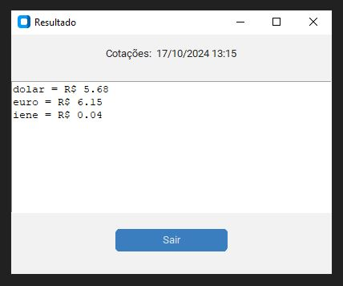

# Coletor de Câmbio

## 💻 Sobre o Projeto

Este projeto coleta as cotações do dólar e do euro diretamente do Google e gera um arquivo PDF com os valores.

## ⚙️ Funcionalidades
- Coleta automatizada de cotações de moedas.
- Geração de relatório em PDF com os valores obtidos.

## 🛠 Tecnologias

O projeto utiliza as seguintes tecnologias:
- **Python 3.12**: Linguagem de programação utilizada.
- **Selenium**: Biblioteca para automação de navegadores.
- **FPDF**: Biblioteca para criação de arquivos PDF.
- **Webdriver Manager**: Gerenciador de drivers para Selenium.

## 📝 Licença

Este projeto é licenciado sob a Licença MIT.

## 🚀 Como Começar

Para começar a utilizar este projeto, siga as etapas abaixo:

1. **Certifique-se de ter o `pip` instalado**: O `pip` é o gerenciador de pacotes para Python. Você pode verificar se ele está instalado executando o seguinte comando no terminal:
    ```bash
    pip --version
    ```
   Se não estiver instalado, você pode seguir as instruções [neste link](https://pip.pypa.io/en/stable/installation/) para instalá-lo.

2. Clone o repositório:
    ```bash
    git clone https://github.com/seu_usuario/colecionador-de-cambio
    ```

3. Navegue até o diretório do projeto:
    ```bash
    cd colecionador-de-cambio
    ```

4. Instale as dependências:
    ```bash
    pip install selenium webdriver-manager fpdf
    ```

5. Execute o script:
    ```bash
    python app.py
    ```

## 📄 Exemplo de Saída

Após a execução, você verá as cotações impressas no console, e numa janela grafica, além do arquivo PDF chamado `valor_yyyyMMdd.pdf` será gerado com as informações coletadas.

## 📸 Imagem do Programa

 <!-- Certifique-se de usar o caminho correto para a imagem -->
